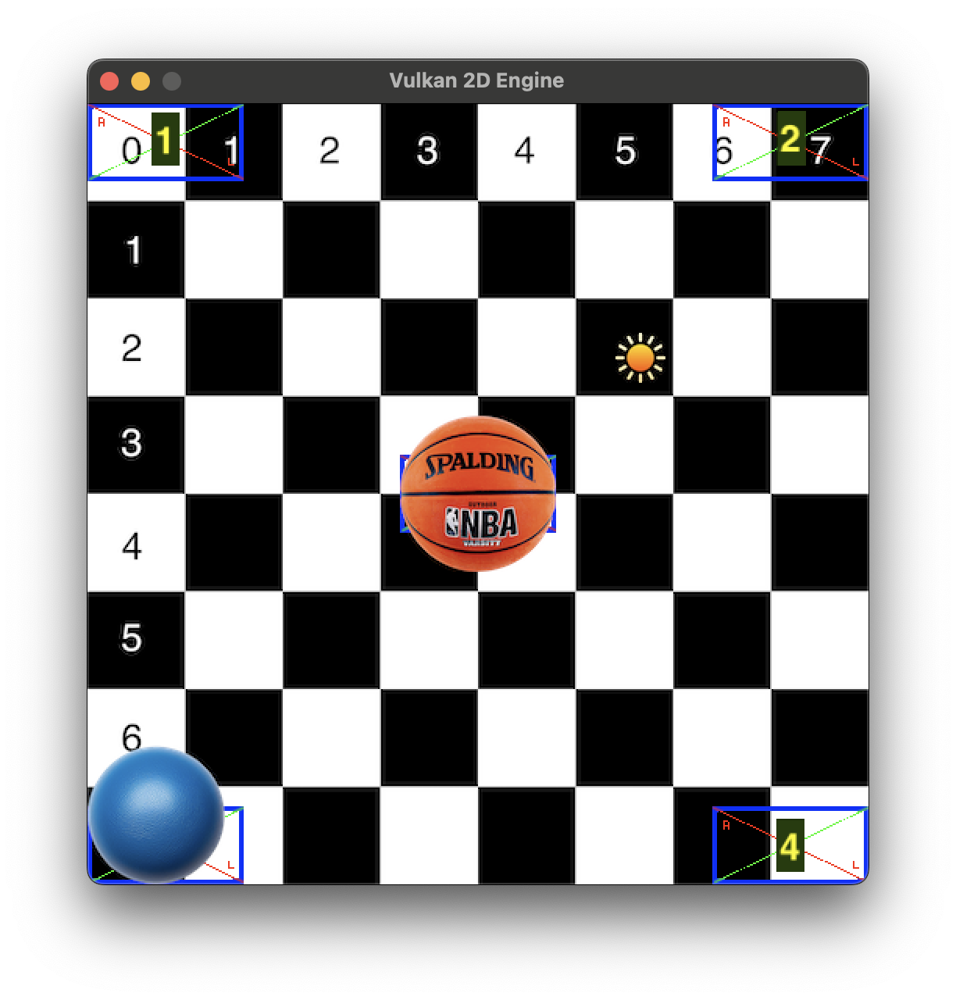

# Vulkan 2D Engine
Trying to learn vulkan and Haskell hand in hand by doing a 2D engine.
```
./run.sh
```

## TODO (doubling as a roadmap)
- [x] Separate vertex buffer
- [x] Sepaerate sempaphores per frame
- [x] Use inflight frame with proper flow
- [x] More than one in-flight frame
- [x] Proper synchronization between frames
- [x] Some memory is not properly freed before vulkan instance is destroyed
- [x] Just use VMA
- [x] Basic texture support
- [x] Make the use of required feaures explicit
- [x] Multiple sprites using different textures in one frame
- [ ] Use a texture atlas probably? Not sure yet
- [x] Investigate sampler2DArray 
- [x] Sprite back-to-front sorting
- [x] Alpha blending?
- [x] Generate Vertex and Index buffers per frame
- [ ] Maybe images from the same buffer as well
- [x] Basic static (no animation) sprite
- [x] Sprite bacthing
- [x] Bindless textures
- [ ] Buffer device addresses
- [ ] GPU driven rendering (DrawIndirect, etc)
- [ ] Basic DearImGUI integration
- [ ] Somewhat model a single moving light source
- [ ] Use normal maps on the static sprite to intract with the light sources
- [ ] Use specular maps for more realism
- [ ] Think about bloom and glow effects
- [ ] Suuport multiple light sources
- [ ] 2D global illumination