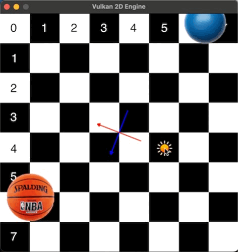
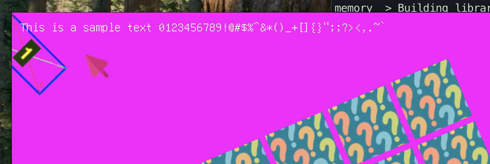
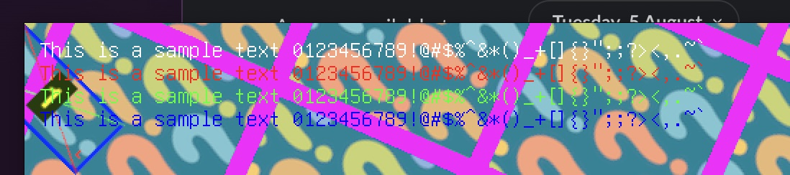
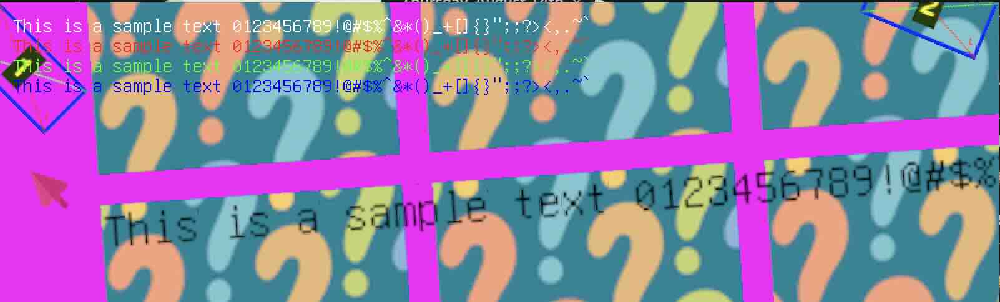

# Vulkan 2D Engine
Trying to learn Vulkan and Haskell hand in hand by doing a 2D engine.

# How to
Compile the shaders:
```
./compile-shaders.sh
```
Generate the atlas
```
./pack-texture.sh
```
### Initial attempts

- Vulkan pipeline
- Basic sprites
- Basic transformations
- No separate Screen and World spaces

### Affine transformations

- SRT (Scale, Rotate, Translate)
- View Projection
- Screen and World spaces

### Text

- Gnu unifont
- Font atlas

### Colored Text

- Colored vertices
- Text in Screen space (fixed on screen, doesn't move with the world)

### World Text

-  Text in World space (moves with the world)
