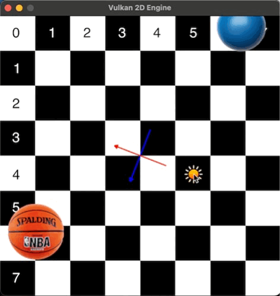

# Vulkan 2D Engine
Trying to learn Vulkan and Haskell hand in hand by doing a 2D engine.

# How to
Compile the shaders:
```
./compile-shaders.sh
```
Generate the atlas
```
./pack-texture.sh
```
Initial attemps


Got the affine transformations and SRT right on the screen and world spaces


git clone -b cabalization --depth 1 --single-branch git@github.com:dagit/freetype2.git && rm -rf freetype2/.git/
